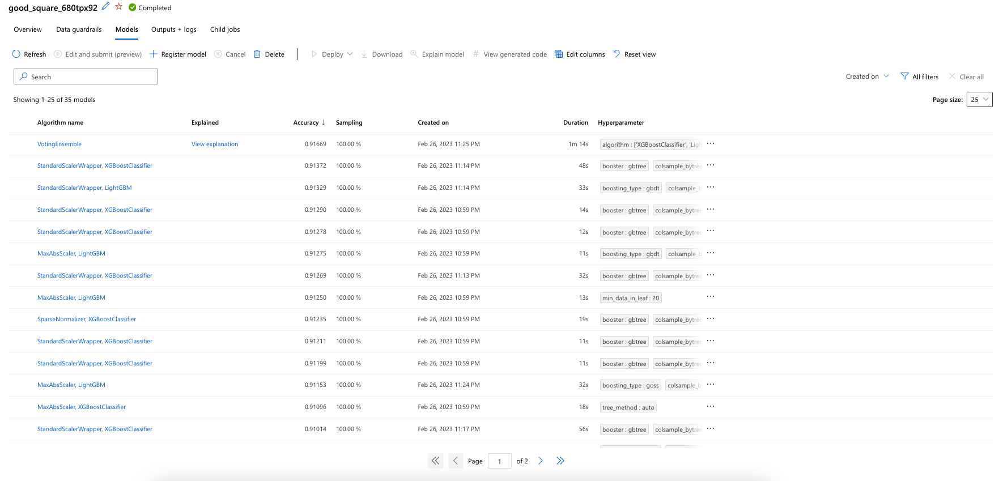

# Optimizing an ML Pipeline in Azure

## Overview
This project is part of the Udacity Azure ML Nanodegree.
In this project, we build and optimize an Azure ML pipeline using the Python SDK and a provided Scikit-learn model.
This model is then compared to an Azure AutoML run.

The solution involves configuring and submitting training runs using the ScriptRunConfig and HyperDriveConfig classes, tuning hyperparameters, and evaluating the performance of the models to determine the best-performing one.

## Useful Resources
- [ScriptRunConfig Class](https://docs.microsoft.com/en-us/python/api/azureml-core/azureml.core.scriptrunconfig?view=azure-ml-py)
- [Configure and submit training runs](https://docs.microsoft.com/en-us/azure/machine-learning/how-to-set-up-training-targets)
- [HyperDriveConfig Class](https://docs.microsoft.com/en-us/python/api/azureml-train-core/azureml.train.hyperdrive.hyperdriveconfig?view=azure-ml-py)
- [How to tune hyperparamters](https://docs.microsoft.com/en-us/azure/machine-learning/how-to-tune-hyperparameters)


## Summary
**In 1-2 sentences, explain the problem statement: e.g "This dataset contains data about... we seek to predict..."**
The UCI Bank Marketing dataset was used in this project to determine whether clients would subscribe to a bank term deposit based on their responses in a direct marketing campaign. The dataset contains binary responses of 'yes' or 'no'. This project is a binary classification problem, and we seek to predict whether a client will subscribe to a term deposit. The data used in this study is available under this [link](https://automlsamplenotebookdata.blob.core.windows.net/automl-sample-notebook-data/bankmarketing_train.csv).

The best performing model was the **Voting Ensemble** model by the AutoML pipeline with a 91.67% accuracy. However, the other models tested vy the pipeline didn't have a poor accuracy at all. A list of trained model by AzureML pipeline is given below:


## Scikit-learn Pipeline
The architecture of the pipeline comprises of various components, including a python training script named "train.py," a tabular dataset obtained from UCI ML Repository, and a Scikit-learn Logistic Regression Algorithm integrated with the Azure HyperDrive. The pipeline incorporates a hyperparameter tuning engine to generate a HyperDrive classifier. A Jupyter Notebook hosted on a compute instance was used to manage the training run. The logical structure of the pipeline is illustrated in the diagram below (Image credit: Udacity MLEMA Nanodegree).

**What are the benefits of the parameter sampler you chose?**

The RandomParameterSampling() method in Azure's HyperDrive enables the configuration of both continuous and discrete hyperparameters, which can be sampled randomly. This method provides a good balance between the exploration and exploitation of the search space, leading to efficient tuning of the hyperparameters. Additionally, it supports early termination of low-performing runs, which saves computation time and resources. By eliminating bias, the RandomParameterSampling() method can lead to increased accuracy of the model. Overall, using RandomParameterSampling() can significantly enhance the performance of a machine learning model. Read here for more information regarding setup and using the sampler: [RandomParameterSampling](https://learn.microsoft.com/en-us/python/api/azureml-train-core/azureml.train.hyperdrive.randomparametersampling?view=azure-ml-py)

The setup for simulation is as following:
>  ``` python
>   ps = RandomParameterSampling(
>    {
>        '--C': choice(0.1, 0.5, 1, 10, 20, 50),
>        '--max_iter': choice(10, 50, 100, 200)
>    }
>)
>   ```

**What are the benefits of the early stopping policy you chose?** 

The advantage of using BanditPolicy() in Azure's HyperDrive is that it enables early termination of low-performing runs, resulting in significant savings in computation time and resources. The policy evaluates each run's performance based on a specified metric and terminates the runs that do not meet a specific threshold relative to the best-performing runs. This approach can lead to faster convergence of the hyperparameter search and can improve the efficiency of the tuning process. By eliminating low-performing runs early on, the BanditPolicy() method can also prevent overfitting and enhance the model's generalization ability. Overall, using BanditPolicy() can significantly speed up the hyperparameter tuning process while improving the model's performance.
Read here for more information regarding setup and using the sampler: [BanditPolicy](https://learn.microsoft.com/en-us/python/api/azureml-train-core/azureml.train.hyperdrive.banditpolicy?view=azure-ml-py&preserve-view=true#&preserve-view=truedefinition)

The setup for simulation is as following:
>   ```python
>   policy = BanditPolicy(slack_factor = 0.1, delay_evaluation = 5, evaluation_interval = 1)
>   ```

## AutoML
**In 1-2 sentences, describe the model and hyperparameters generated by AutoML.**

## Pipeline comparison
**Compare the two models and their performance. What are the differences in accuracy? In architecture? If there was a difference, why do you think there was one?**

## Future work
**What are some areas of improvement for future experiments? Why might these improvements help the model?**

## Proof of cluster clean up
**If you did not delete your compute cluster in the code, please complete this section. Otherwise, delete this section.**
**Image of cluster marked for deletion**
