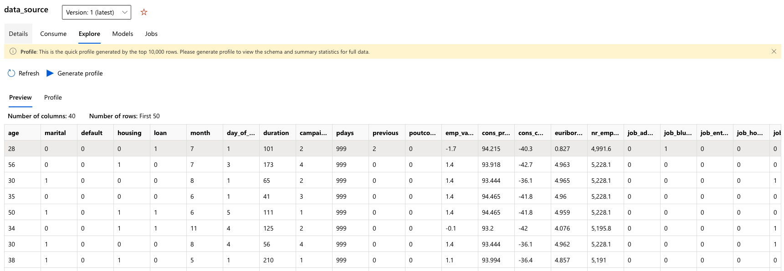
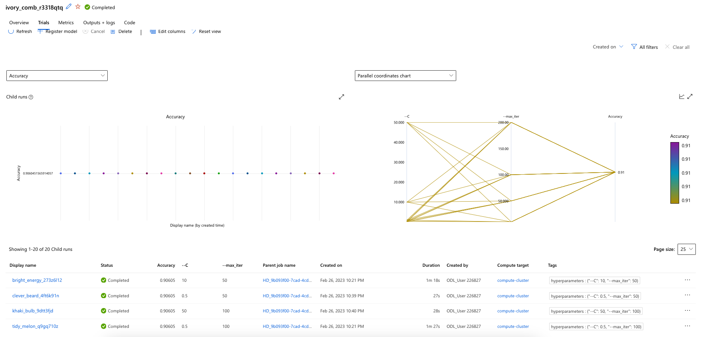
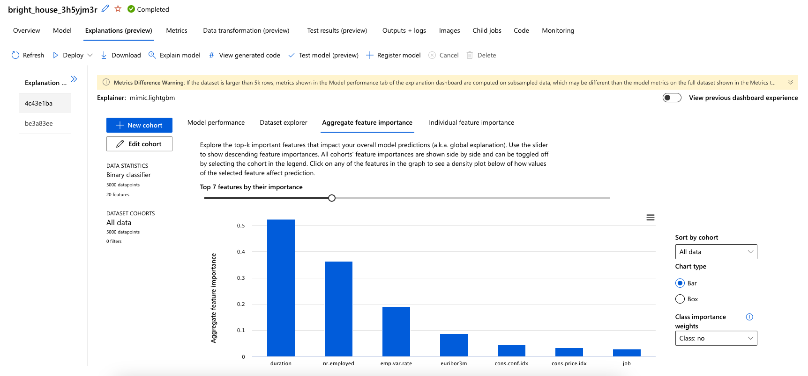
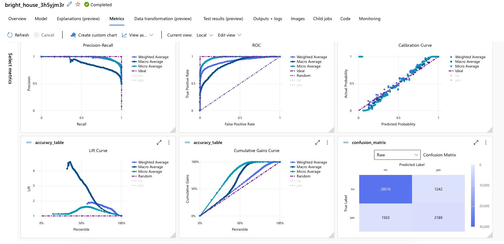

# Optimizing an ML Pipeline in Azure

## Overview
This project is part of the Udacity Azure ML Nanodegree.
In this project, we build and optimize an Azure ML pipeline using the Python SDK and a provided Scikit-learn model.
This model is then compared to an Azure AutoML run.

The solution involves configuring and submitting training runs using the ScriptRunConfig and HyperDriveConfig classes, tuning hyperparameters, and evaluating the performance of the models to determine the best-performing one.

## Useful Resources
- [ScriptRunConfig Class](https://docs.microsoft.com/en-us/python/api/azureml-core/azureml.core.scriptrunconfig?view=azure-ml-py)
- [Configure and submit training runs](https://docs.microsoft.com/en-us/azure/machine-learning/how-to-set-up-training-targets)
- [HyperDriveConfig Class](https://docs.microsoft.com/en-us/python/api/azureml-train-core/azureml.train.hyperdrive.hyperdriveconfig?view=azure-ml-py)
- [How to tune hyperparamters](https://docs.microsoft.com/en-us/azure/machine-learning/how-to-tune-hyperparameters)


## Summary
The UCI Bank Marketing dataset was used in this project to determine whether clients would subscribe to a bank term deposit based on their responses in a direct marketing campaign. The dataset contains binary responses of 'yes' or 'no'. This project is a binary classification problem, and we seek to predict whether a client will subscribe to a term deposit. The data used in this study is available under this [link](https://automlsamplenotebookdata.blob.core.windows.net/automl-sample-notebook-data/bankmarketing_train.csv).

The header of the data which is loaded to workspace is shown below:



The best performing model was the **Voting Ensemble** model by the AutoML pipeline with a 91.67% accuracy. However, the other models tested vy the pipeline didn't have a poor accuracy at all.

## Scikit-learn Pipeline
The architecture of the pipeline comprises of various components, including a python training script named "train.py," a tabular dataset obtained from UCI ML Repository, and a Scikit-learn Logistic Regression Algorithm integrated with the Azure HyperDrive. The pipeline incorporates a hyperparameter tuning engine to generate a classifier. A Jupyter Notebook hosted on a compute instance was used to manage the training run. The pipeline is illustrated in the diagram below.

For an AutoML by Azure, the tabular data will be fed to AutoML and will be trained by Azure automatically and testing variety of classification algorithms. The method is simpler to be used in comparison to the first method. 


[ML Pipeline Reference](https://learn.udacity.com/nanodegrees/nd00333/parts/cd0600/lessons/fe72a17d-091f-4c9c-b341-d2fea440a791/concepts/5632c8e6-e3ac-4873-a9b5-b1164387e6fb)

**Selection criterion for parameter sampler**

The RandomParameterSampling() method in Azure's HyperDrive enables the configuration of both continuous and discrete hyperparameters, which can be sampled randomly. This method provides a good balance between the exploration and exploitation of the search space, leading to efficient tuning of the hyperparameters. Additionally, it supports early termination of low-performing runs, which saves computation time and resources. By eliminating bias, the RandomParameterSampling() method can lead to increased accuracy of the model. Overall, using RandomParameterSampling() can significantly enhance the performance of a machine learning model. Read here for more information regarding setup and using the sampler: [RandomParameterSampling](https://learn.microsoft.com/en-us/python/api/azureml-train-core/azureml.train.hyperdrive.randomparametersampling?view=azure-ml-py).

The setup for simulation is as following:
>  ``` python
>   ps = RandomParameterSampling(
>    {
>        '--C': choice(0.1, 0.5, 1, 10, 20, 50),
>        '--max_iter': choice(10, 50, 100, 200)
>    }
>)
>   ```

**Selection of early stopping policy**

The advantage of using BanditPolicy() in Azure's HyperDrive is that it enables early termination of low-performing runs, resulting in significant savings in computation time and resources. The policy evaluates each run's performance based on a specified metric and terminates the runs that do not meet a specific threshold relative to the best-performing runs. This approach can lead to faster convergence of the hyperparameter search and can improve the efficiency of the tuning process. By eliminating low-performing runs early on, the BanditPolicy() method can also prevent overfitting and enhance the model's generalization ability. Overall, using BanditPolicy() can significantly speed up the hyperparameter tuning process while improving the model's performance.
Read here for more information regarding setup and using the stopping policy: [BanditPolicy](https://learn.microsoft.com/en-us/python/api/azureml-train-core/azureml.train.hyperdrive.banditpolicy?view=azure-ml-py&preserve-view=true#&preserve-view=truedefinition).

The setup for simulation is as following:
>   ```python
>   policy = BanditPolicy(slack_factor = 0.1, delay_evaluation = 5, evaluation_interval = 1)
>   ```

## AutoML
AutoMLConfig Class represents configuration for submitting an automated ML experiment in Azure Machine Learning. Documentation on AutoMLConfig can be found [here](https://learn.microsoft.com/en-us/python/api/azureml-train-automl-client/azureml.train.automl.automlconfig.automlconfig?view=azure-ml-py). The configuration of the AutoML is defined as below:

>   ```python
>   automl_config = AutoMLConfig(
>       compute_target = aml_compute,
>       experiment_timeout_minutes=30,
>       task='classification',
>       primary_metric='accuracy',
>       training_data=dataset,
>       label_column_name='y',
>       enable_onnx_compatible_models=True,
>       n_cross_validations=2)
>   ```
The experiment timeout is set to 30 minutes and the task of AutoML is set for **classification**. The AutoML uses different classification methods and predicts the target values and calculates the prediction accuracy correspondingly. Among the results the VotingEnsemble could predict the target value with the highest value however, its performance is not much better than other methods. It can perform the classification task with 91.67% accuracy.

## Pipeline comparison
**Compare the two models and their performance. What are the differences in accuracy? In architecture? If there was a difference, why do you think there was one?**

The results of trained model by SKlearn using LogisticRegression with its performance is given below. The best model has an accuracy of 90.65%. Where the other models have the same performance.


A list of trained model by AutoML with their performance is given below:


### Comparison of these two models
The models do not have a big difference in prediction accuracy. Nevertheless, the SKlearn model has to be configured in advance where the AutoML selects the models configuration itself and needs less work.

AutoML can also analyze teh data additionally. For example it can be seen which input has the highest impact. The first 7 most impactful inputs on the model performance is given below:



In figure below the metrics for the trained model is given:


## Future works
1. Deploy the model and validate it against new data and check it performance
2. Tune the hyper parameter configurations with a higher range of parameter changes


## Proof of cluster clean up
**If you did not delete your compute cluster in the code, please complete this section. Otherwise, delete this section.**

**Image of cluster marked for deletion**

## External Links
1. [AutoMLConfig Class](https://learn.microsoft.com/en-us/python/api/azureml-train-automl-client/azureml.train.automl.automlconfig.automlconfig?view=azure-ml-py) 
2. [Udacity AZMLND Starter Files](https://github.com/udacity/nd00333_AZMLND_Optimizing_a_Pipeline_in_Azure-Starter_Files)
3. [Compute Target Setup](https://azure.github.io/azureml-cheatsheets/docs/cheatsheets/python/v1/compute-targets/)