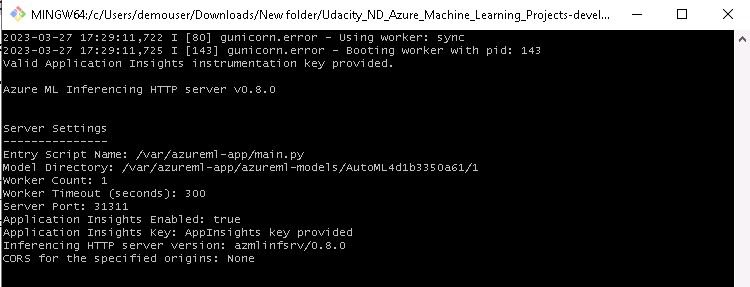
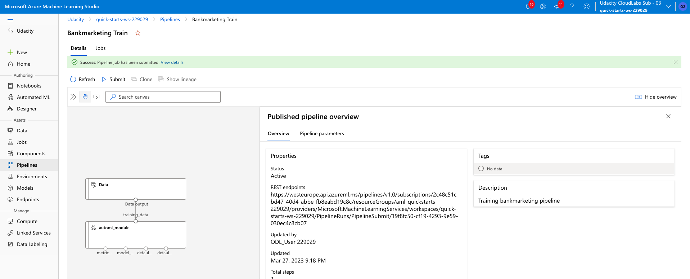

# Operationalizing Machine Learning
This is the second project in the framework of **Udacity Machine Learning Engineer Microsoft Azure Nanodegree Course**. The task is to train a best model, deploying it using AutoML and Python SDK. Several steps are made to realize the objectives of the project which are given shortly in following section.

- The first section of the project is regarding creating a machine learning model using AutoML and deploying a best model and consume it finally.
- The second part of the project is using Python SDK for creating, training and publishing a pipeline.

The dataset provided by Udacity regarding Bank Marketing is used for a classification task. The objective of classification is to predict wether a client subscribes a bank deposit term or not.

## Architectural Diagram
An architectural diagram of operations for operationalizing machine learning is shown in Figure 1.

Figure 1: Operationalizing Machine Learning (Image is taken from: Udacity Machine Learning Engineer Microsoft Azure Nanodegree Course)

## Key Steps
The key steps of this project are:

**1. Authentication:**
It is not possible to create a Service Principal using the lab provided, this is due to *Insufficient privileges to complete the operation*. However this step is not a blocker for next steps.

**2. Automated ML Experiment:**
In this step, an AutoML is used to train a set of models based on the provided dataset and setting inputs and outputs.

**3. Deploy the best model:**
The best model with highest accuracy has to be selected for deployment and has to be used for further queries.

**4. Enable logging:**
In this step the Application Insights has to be enabled.

**5. Swagger Documentation**
An interface to make request from deployed model and getting its response.

**6. Consume model endpoints**
The model will then be consumed using aavailable API and two set of inputs will be tested.

**7. Create and publish a pipeline**
In this step, a pipeline will be created, an endpoint will be published and automating all the steps.

## Project Steps
The steps of projects are explained in detail in following sections.

### 1. Authentication
This step is jumped over as it could not be implemented due to insufficient authorization for creating a security principal.

### 2. Automated ML Experiment
In this project, a set of classification models on `Bank Marketing` dataset are trained, and athe one with the highest accuracy is taken for deployment.

The data can be analyzed in advanced and check some metrics before starting the experiment.

The experiment started successfully and took around 1 hour to be completed, the maximum training time is set to 1 hour so the resources would not be overloaded by model training.

The experiment is completed successfully and variety of models are trained using AutoML.

A short summary of the job is given below:

A section of trained models is given below:

The best model for deployment is the one from VotingEnsemble training which can predict the target value by 95%. 

The best model metrics are given in figure below:

A short explanation of the best model is given bwelow and showing the important of input variables with highest impact:

The AutoML Model Training is completed successfully, so the best model is ready for deployment.

### 3. Deploy the best model
The best model for deployment is the one as VotingEnsemble and has accuracy for prediction by 95%. The deploying process can be seen following figure:

The deployment will be finished after a short time, considering that the Azure Container Instance (ACI) is used and authentication is activated.

### 4. Enable logging
The next step is to enable Application Insights. To do so, fist the config file of has to be downloaded. The content of this config file looks like following figure:

 
 Now by running `logs.py`, the Application Insights will be enabled and it can be seen in the endpoint section of ML Studio for the selected deploced model. 
 
 

 The status is shown in following figure:

The dashboard now shows the status and activities of the deployed model.

### 5. Swagger Documentation
In this section, firstly the `swagger.json` has to be downloaded and then running the `swagger.sh` and `serve.py`. The results now can be observed on `localhost:8000`.

The swagger run can now be obsered on the localhost as following figures:

The deployment can be found on port 8000 of the localhost, it can be realized by downloading the `swagger.json`, starting the docker and running the `swagger.sh`. The results is shown below:

The get and response of the API introduced in the swagger as following: 

### 6. Consume model endpoints
Now it is time to consume the model from the endpoint, the `scoring_uri` and the `key` has to be updated in the `endpoint.py` for the service, one can give several input data so to test the API and the model as following:

by running the `python endpoint.py` following response should be provided:
{"result": ["yes", "no"]}

### 7. Create and publish a pipeline
- The pipeline section of Azure ML studio, showing that the pipeline has been created

Then the pipeline will be run:

Then the pipeline is finished now:
 

- The pipelines section in Azure ML Studio, showing the Pipeline Endpoint

- The Bankmarketing dataset with the AutoML module

- The “Published Pipeline overview”, showing a REST endpoint and a status of ACTIVE

- In Jupyter Notebook, showing that the “Use RunDetails Widget” shows the step runs

- In ML studio showing the scheduled run

## Screencasting
A video is provided indicating different steps of using AutoML and python SDK for training a best model for classification of Bank Marketing Dataset.

## Suggestions and Future Steps
- Use different model setups for possible increase of model performance.
- Test the model for more tests point.
- Validate the performanc of the model for unseen data.
- Increase permitted training time and iteations for increasing the model performance.
- Train the model based on the inputs with highest impact on the model performance.
- Possible increase of AutoML automation.
