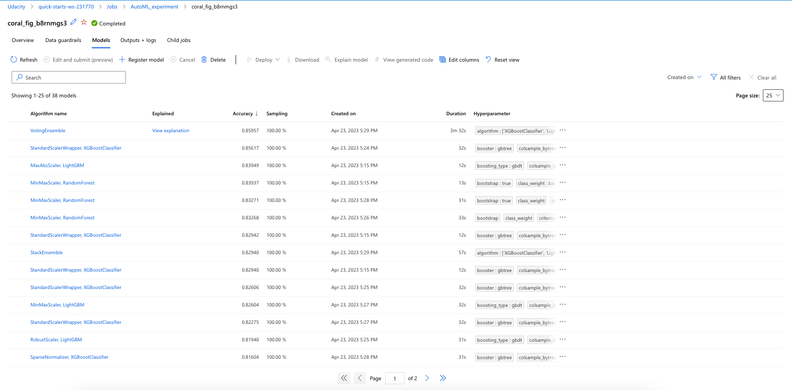
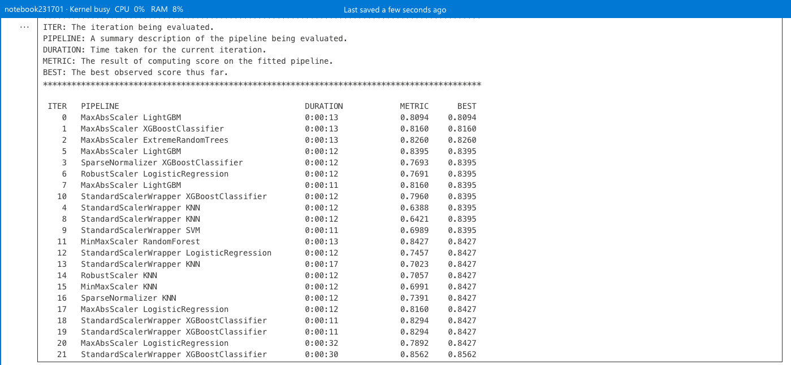
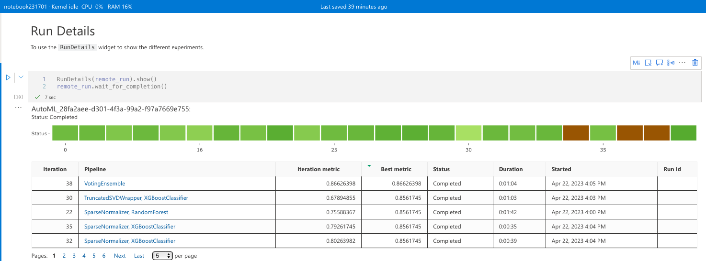
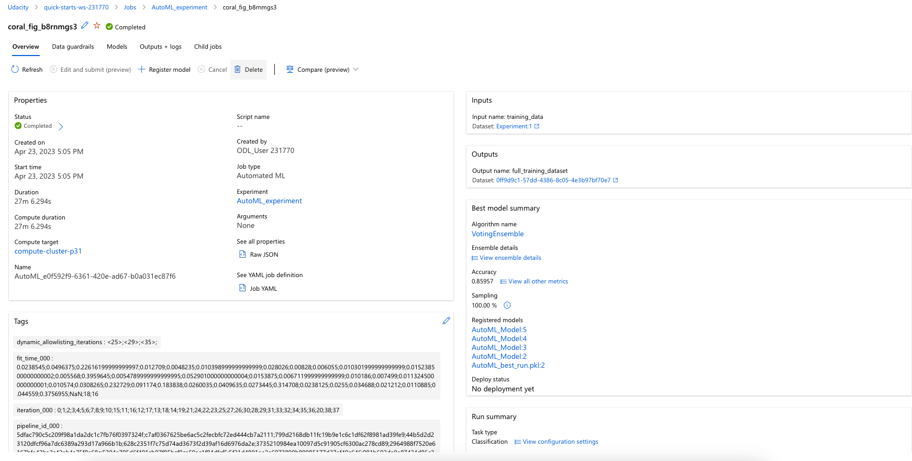
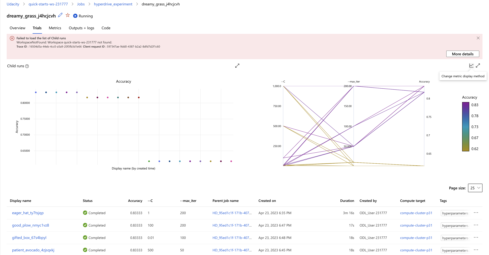
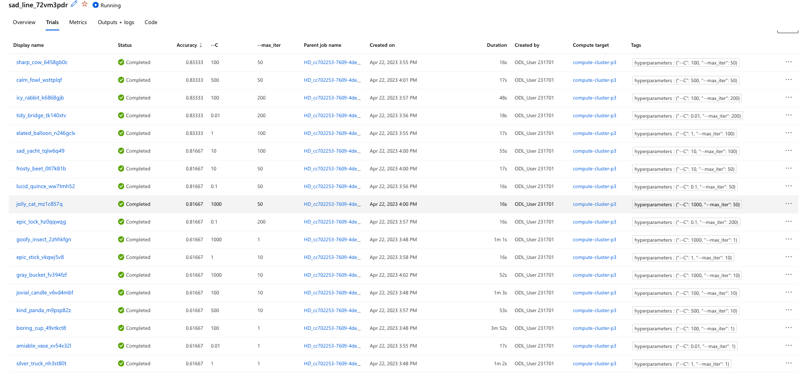
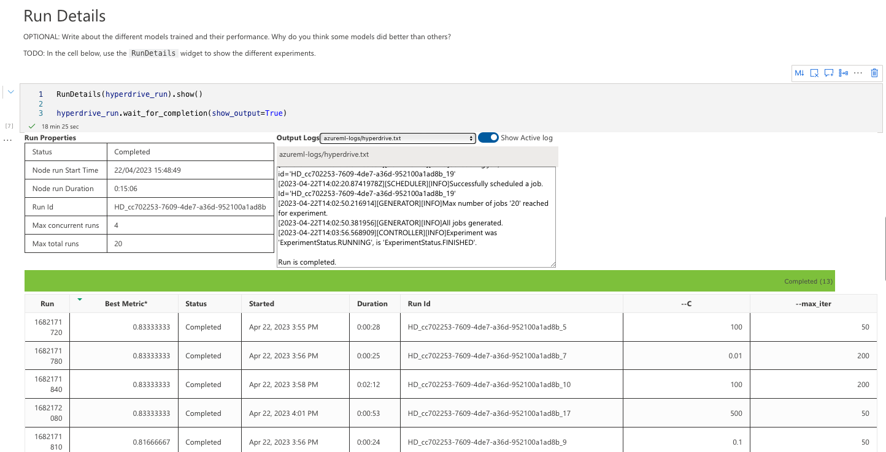
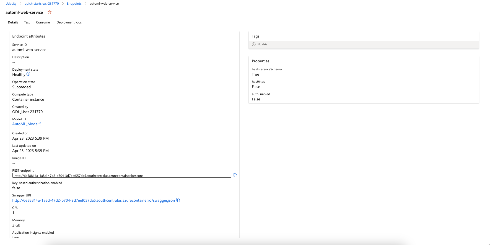
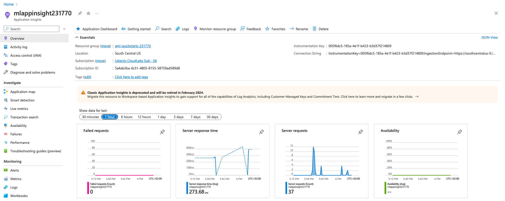

# Prediction of survival of partient with heart problems
In this project, in the framework of Udacity capstone project, the survival of patients with heart problems based on their bio data. A `hyperdrive` model and `automl` from azureml to will be used to build this project. The data are from kaggle and are publicly available. In this project, 'Heart Failure Prediction' dataset from Kaggle to build a classification model.

The diagram below shows that after loading the data, two experiments will be run and the best run from each of them will be selected for further deployment. The models are trained by Automated ML and HyperDrive. The model from AutoML is then deployed over a web service.


## Project Set Up and Installation
Following codes are available on the repository:
- *automl.ipynb*
- *hyperparameter_tuning.ipynb*
- *train.py*
- *sort.py*

Following dataset is needed for the case when the data is not available publically.
- *heart_failure_clinical_records_dataset.csv*

## Dataset

### Overview
The `heart_failure_clinical_records_dataset.csv` is a dataset available on Kaggle that contains data on 299 patients with heart failure. The dataset contains 13 features that describe the patients' clinical and demographic characteristics, as well as an indicator variable that denotes whether or not the patient died during follow-up.

The 13 features in the dataset are:

1. `age`: The age of the patient in years.
2. `anaemia`: A binary variable indicating whether or not the patient has anemia (0 = no, 1 = yes).
3. `creatinine_phosphokinase`: The level of the enzyme creatinine phosphokinase (CPK) in the patient's blood (measured in mcg/L).
4. `diabetes`: A binary variable indicating whether or not the patient has diabetes (0 = no, 1 = yes).
5. `ejection_fraction`: The percentage of blood that is ejected from the heart during each contraction (measured as a percentage).
6. `high_blood_pressure`: A binary variable indicating whether or not the patient has high blood pressure (0 = no, 1 = yes).
7. `platelets`: The level of platelets (cells that help with blood clotting) in the patient's blood (kiloplatelets/mL).
8. `serum_creatinine`: The level of creatinine (a waste product) in the patient's blood (mg/dL).
9. `serum_sodium`: The level of serum sodium in the blood (mEq/L)
10. `sex`: The gender of the patient (0 = female, 1 = male)
11. `smoking`: The condition whether or not the patient is a smoker (0 = no, 1 = yes)
12. `time`: The follow-up period (days)
13. `DEATH_EVENT`: The fact that whether or not the patient died during the follow-up period (0 = no, 1 = yes)

A summary of the data can be found in follwoing table:
| Feature               | Description                                     | Data Type |
|-----------------------|-------------------------------------------------|-----------|
| age                   | Age of the patient                              | Numeric   |
| anaemia               | Decrease of red blood cells or hemoglobin        | Boolean   |
| creatinine_phosphokinase | Level of the CPK enzyme in the blood             | Numeric   |
| diabetes              | If the patient has diabetes                     | Boolean   |
| ejection_fraction     | Percentage of blood leaving the heart at each contraction | Numeric   |
| high_blood_pressure   | If the patient has hypertension                 | Boolean   |
| platelets             | Platelets in the blood                           | Numeric   |
| serum_creatinine      | Level of serum creatinine in the blood           | Numeric   |
| serum_sodium          | Level of serum sodium in the blood               | Numeric   |
| sex                   | Gender of the patient                            | Boolean   |
| smoking               | If the patient smokes                            | Boolean   |
| time                  | Follow-up period                                | Numeric   |
| DEATH_EVENT           | If the patient deceased during the follow-up period | Boolean   |


### Task
The task is to predict the `DEATH_EVENT` based on the patient's other bio data.

### Access
The data are available on kaggle under this link: [Heart Failure Clinical Records dataset](https://www.kaggle.com/andrewmvd/heart-failure-clinical-data)


## Automated ML
In general, the automl settings and configuration used for an experiment may include the following:
- experiment_timeout_minutes: The maximum amount of time in minutes that the experiment should run.
- max_concurrent_iterations: The maximum number of iterations that can run concurrently.
- primary_metric: The metric used to evaluate the performance of the model.
- task: The type of task that the model is performing (e.g. classification, regression).
- training_data: The training data used to train the model.
- label_column_name: The name of the column containing the labels in the training data.
- n_cross_validations: The number of cross validations to perform during model training.
- compute_target: The compute target used to run the experiment.
- enable_early_stopping: Whether to enable early stopping of poorly performing models.
- featurization: The method used to featurize the data (e.g. auto, on, off).
- debug_log: Whether to enable debug logging during model training.

The setup for running AutoML is given in follwoing script:
```python
# Automl settings
automl_settings = {"n_cross_validations": 2,
                   "primary_metric": 'accuracy',
                   "enable_early_stopping": True,
                   "max_concurrent_iterations": 4,
                   "experiment_timeout_minutes": 20,
                   "verbosity": logging.INFO
                   }

# Parameters for AutoMLConfig
automl_config = AutoMLConfig(compute_target = aml_compute,
                            task='classification',
                            training_data=dataset,
                            label_column_name='DEATH_EVENT',
                            path = project_folder,
                            featurization= 'auto',
                            debug_log = "automl_errors.log",
                            **automl_settings
                            )
```

### Results
A VotingEnsemble can predict the objective function at best. The accuracy of training is around 86%.



The result of training in the experiment can be observed as well in the script:



A screenshot of the `RunDetails` widget as well as a screenshot of the best model trained with it's parameters.



The best model info is given in below screenshot:


| Run                                                  |                                                  |
|------------------------------------------------------|--------------------------------------------------|
| Experiment                                           | AutoML_experiment                                |
| Id                                                   | AutoML_e0f592f9-6361-420e-ad67-b0a031ec87f6_37   |
| Type                                                 | azureml.scriptrun                                |
| Status                                               | Completed                                        |

## Hyperparameter Tuning
For this experiment, the Scikit-learn logistic regression algorithm as our base model is used. It is chosen because it is a simple and interpretable model that works well for binary classification problems like this one.

The hyperparameters that are used for optimization for this model are `C` and `max_iter`. The `C` is the inverse of regularization strength, and controls the trade-off between fitting the training data well and preventing overfitting. `max_iter` is the maximum number of iterations for the solver to converge.

The random parameter sampling to search over the hyperparameter space has following:

| Parameter	| Values |
|------------------------------------------------------|--------------------------------------------------|
| C	| 0.01, 0.1, 1, 10, 100, 500, and 1000 |
| max_iter |	1, 10, 50, 100, and 200 |


Overall, we wanted to explore a wide range of regularization strengths and iteration values to see which ones would give the best performance on our dataset.

``` python
# Create an early termination policy
early_termination_policy = BanditPolicy(slack_factor = 0.1, delay_evaluation = 2)

# Create the different params that you will be using during training
param_sampling = RandomParameterSampling(
    {
        '--C' : choice(0.01,0.1,1,10,100,500,1000),
        '--max_iter': choice(1,10,50,100,200)
    }
)

if "training" not in os.listdir():
    os.mkdir("./training")
    
# Setup environment for your training run
sklearn_env = Environment.from_conda_specification(name='sklearn-env', file_path='conda_dependencies.yml')

est = SKLearn(source_directory = "./",
              compute_target=aml_compute,
              vm_size='STANDARD_D2_V2',
              entry_script="train.py")

# Create a HyperDriveConfig using the src object, hyperparameter sampler, and policy
hyperdrive_run_config = HyperDriveConfig(estimator=est,
                                         hyperparameter_sampling=param_sampling,
                                         policy=early_termination_policy,
                                         primary_metric_name='Accuracy',
                                         primary_metric_goal=PrimaryMetricGoal.MAXIMIZE,
                                         max_total_runs=20,
                                         max_concurrent_runs=4)
```


### Results
An experiment is trained and the best model with following performance and parameter setting.





A screenshot of the `RunDetails` widget as well as a screenshot of the best model trained with it's parameters.



## Model Deployment
Deploy the trained model as a web service using Azure Machine Learning Service. The model should be deployed in a scalable and reliable way that can handle multiple requests.






## Screen Recording
A link to a screen recording of the project in action including following points can be found here:

[Udacity NDMLEMA Project 3](https://youtu.be/YQuMx3mNnYk)

- A working model
- Demo of the deployed  model
- Demo of a sample request sent to the endpoint and its response

## Some Usefull Links
Some links with useful information used for building this project:

- [Automated ML Overview](https://learn.microsoft.com/en-us/azure/machine-learning/concept-automated-ml?view=azureml-api-2&viewFallbackFrom=azure-ml-py)
- [HyperDrive Overview](https://learn.microsoft.com/en-us/azure/machine-learning/how-to-tune-hyperparameters?view=azureml-api-2&viewFallbackFrom=azure-ml-py)
- [Deploy and Consume your model](https://learn.microsoft.com/en-us/azure/machine-learning/how-to-authenticate-online-endpoint?view=azureml-api-2&viewFallbackFrom=azure-ml-py&tabs=azure-cli#call-the-service-python)
- [Hyperparameter tuning for ML models example](https://github.com/microsoft/MLHyperparameterTuning)
